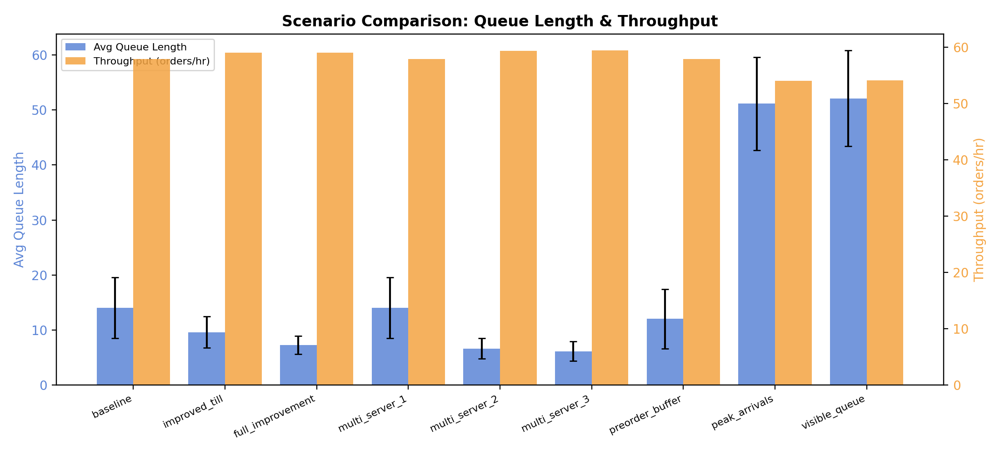

# Coffee Shop Workflow Optimization

### Queueing Simulation for Bottleneck Analysis in Service Systems

Service delays are often blamed on workers, but many delays are caused by system design.  
This project simulates a multi-stage workflow to identify bottlenecks and test practical interventions.

Applicable domains:
- coffee shop operations
- healthcare flow (triage -> diagnostics -> treatment)
- other serial service pipelines

## 1. Project Summary (30-60 sec)
- Question: are delays a people issue or a system architecture issue?
- Method: discrete-time stochastic queue simulation plus 300-run Monte Carlo.
- Deliverable: reproducible scenario configs, KPI summaries, and comparison plots.
- Finding: queue and wait usually improve faster than throughput because throughput is capped by the active bottleneck.

## 2. Key Results



| Scenario | Avg System Load (Lbar) | Throughput (/h) | Avg Wait |
|---|---:|---:|---:|
| Baseline | 14.05 | 57.90 | 14.56 min |
| Improved Till | 9.61 | 59.03 | 9.77 min |
| Full Improvement | 7.24 | 59.01 | 7.36 min |
| Peak Arrivals | 51.15 | 54.02 | 56.81 min |

Key takeaways:
- Demand spikes mostly increase waiting, not system capacity.
- Bottleneck-targeted interventions produce the highest ROI.
- Structural design changes beat ad-hoc speed pressure on individuals.

## 3. Model and Approach

### System Model
```text
Arrival -> Till (q0) -> Shots (q1) -> Milk (q2) -> Exit
```

### Stochastic Dynamics
- Arrivals: `A_t ~ Poisson(lambda(t) * dt)`
- Stage capacity: `S_{i,t} ~ Poisson(mu_i * dt)`
- Per-step service: `served = min(queue, capacity)`

### Metrics
- `Lbar = mean(q0 + q1 + q2)`
- `Throughput = completed_orders / simulation_time`
- `W ~= Lbar / Throughput` (Little's Law proxy)

## 4. How to Run

### Setup
```bash
git clone https://github.com/goneyak/coffee-shop-workflow-optimization.git
cd coffee-shop-workflow-optimization
python3 -m venv .venv
source .venv/bin/activate
pip install -r requirements.txt
```

### Run one scenario
```bash
python -m src.experiments --config configs/baseline.yaml
```

### Run all scenarios
```bash
for f in configs/*.yaml; do
  python -m src.experiments --config "$f"
done
```

### Generate figures
```bash
python run_plots.py
```

## 5. Repository Structure

```text
src/
  simulation.py
  experiments.py
  plotting.py

configs/
  *.yaml

results/
  <scenario>/summary.csv
  *.png

docs/
  core_*
  scenario_*
  archive_*
```

## 6. Extensions and Future Work
- customer abandonment (balking/reneging)
- cost-aware staffing optimization
- real POS timestamp calibration
- dynamic staffing by hour

## Detailed Docs
- Docs index: `docs/README.md`
- Core map: `docs/core_00_project_map.md`
- Base model: `docs/core_01_base_model.md`
- One-page summary: `docs/core_04_executive_summary.md`

## Why This Matters
As utilization approaches capacity, queues grow nonlinearly.  
This project demonstrates how system-level changes can improve service reliability.
