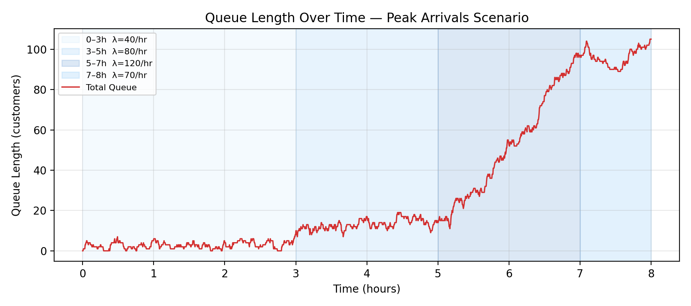

# Extension: Time-Varying Arrivals (Peak Modeling)

## Motivation
Real demand varies by time-of-day. Constant λ underestimates rush-hour queue formation.

## Modeling change
Replace constant arrival rate with piecewise time-varying demand:

- Non-homogeneous Poisson arrivals: `A_t ~ Poisson(lambda(t) * dt)`
- Example profile used in this project:
	- 0-3h: 40/hr
	- 3-5h: 80/hr
	- 5-7h: 120/hr
	- 7-8h: 70/hr

## Experiment Setup
- Config: `configs/peak_arrivals.yaml`
- Simulation horizon: 8 hours
- Runs: 300 Monte Carlo replications

## Results (runs=300)

| Metric | Value |
|---|---:|
| mean_avg_queue | 51.146 |
| mean_throughput (/h) | 54.015 |
| mean_wait_approx (h) | 0.947 |
| mean_q0 | 45.477 |
| mean_q1 | 2.065 |
| mean_q2 | 3.604 |
| mean_peak_q0 | 155.150 |
| mean_peak_total | 164.500 |

Interpretation:
- Demand surges primarily amplify queueing and waiting, not service completion rate.
- Front-stage queue (`q0`) dominates visible congestion under peak pressure.
- Peak overload propagates across all stages and creates a large total in-system WIP.

## Visualization

Related result file:
- `results/peak_arrivals/summary.csv`

## Next
- Visible queue vs hidden backlog decomposition: `docs/04_visible_queue.md`