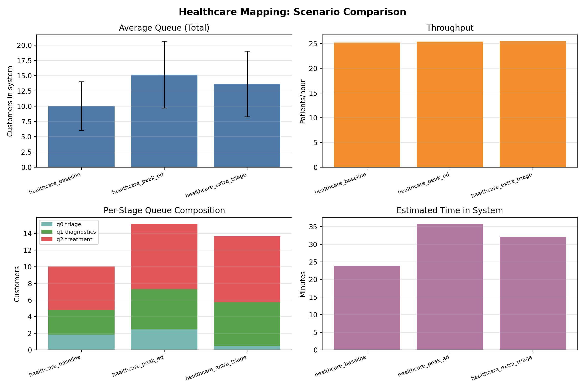

# Generalization: Healthcare Operations Mapping

## Motivation
Serial high-utilization systems appear across healthcare workflows.

## Mapping
Coffee shop:
- Till → Shots → Milk

Healthcare analogy:
- Triage → Diagnostics → Treatment

## Why it matters
- Bottleneck identification
- Staffing decisions
- Patient wait-time reduction
- System-level vs individual blame

## Implemented Scenario Set
Added healthcare-analogy scenarios as config-based experiments:

- `configs/healthcare_baseline.yaml`
- `configs/healthcare_peak_ed.yaml`
- `configs/healthcare_extra_triage.yaml`

Conceptual stage mapping:
- Till -> Triage
- Shots -> Diagnostics
- Milk -> Treatment

## Results (runs=300)

| Scenario | mean_avg_queue | mean_throughput (/h) | mean_wait_approx (h) | mean_q0 (Triage) | mean_q1 (Diagnostics) | mean_q2 (Treatment) | mean_peak_total |
|---|---:|---:|---:|---:|---:|---:|---:|
| healthcare_baseline | 10.046 | 25.201 | 0.399 | 1.834 | 2.951 | 5.260 | 24.433 |
| healthcare_peak_ed | 15.193 | 25.412 | 0.598 | 2.469 | 4.822 | 7.902 | 38.667 |
| healthcare_extra_triage | 13.655 | 25.521 | 0.535 | 0.467 | 5.266 | 7.923 | 36.857 |

## Interpretation
- Peak-demand ED profile (`healthcare_peak_ed`) increases total congestion and waiting time substantially versus baseline.
- Adding triage capacity (`healthcare_extra_triage`) strongly reduces visible front-door queue (`q0`) and improves average wait.
- Throughput changes only slightly, while diagnostics/treatment queues remain elevated under peak conditions.
- Operational lesson: front-door staffing improves perceived queue quickly, but downstream treatment capacity is still the limiting factor for end-to-end delay.

## Visualization

