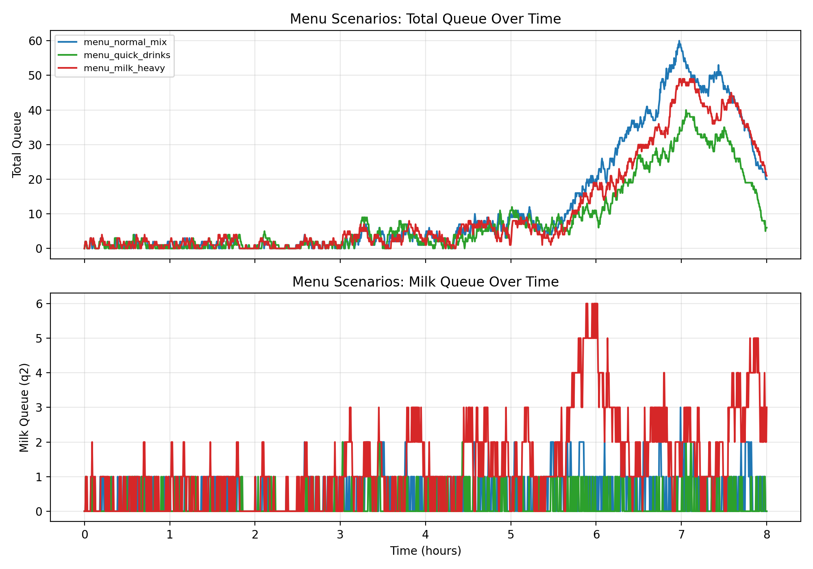

# Scenario 7 - Menu-Dependent Service Times

## Motivation
Milk station time varies greatly by drink type (oat/matcha/hot chocolate/iced).

## Modeling change
Use mixture service capacity:
- With probabilities p_k, draw capacity from different effective μ values
or
- Model each order carries a "type" that affects downstream μ

## Implementation status
Implemented with order-level simulation (Option B):
- Each arrival is sampled as a menu item with modifiers.
- Till/Shots/Milk service times are computed per order.
- Orders move through stages based on drink requirements.
- Stage service now supports multi-step processing via remaining-time budgets.

## Experiments
Compared three menu mixes under identical staffing (1,1,1) and peak-profile arrivals.

Latest results (`runs=300`):

| Scenario | mean_avg_queue | mean_throughput (/h) | mean_q0 | mean_q1 | mean_q2 | mean_peak_total |
|---|---:|---:|---:|---:|---:|---:|
| menu_quick_drinks | 10.463 | 72.141 | 8.446 | 1.839 | 0.179 | 46.097 |
| menu_normal_mix | 11.372 | 71.699 | 10.463 | 0.470 | 0.439 | 49.117 |
| menu_milk_heavy | 12.679 | 71.239 | 10.614 | 0.662 | 1.403 | 52.437 |

Interpretation:
- `menu_milk_heavy` increases Milk-stage load (`mean_q2`) and worst-case total queue.
- `menu_quick_drinks` still keeps the highest throughput, but single-origin brew
	handling raises shots-stage pressure (`mean_q1`) relative to previous runs.
- Till (`q0`) remains the dominant queue contributor in all three mixes.

## Time-Series Comparison

Figure reading guide:
- Top panel: total queue over time for each menu scenario.
- Bottom panel: Milk-stage queue (`q2`) over time, highlighting milk-heavy pressure.

Raw time-series files:
- `results/menu_normal_mix/queue_timeseries.csv`
- `results/menu_quick_drinks/queue_timeseries.csv`
- `results/menu_milk_heavy/queue_timeseries.csv`

## Next
- Healthcare mapping